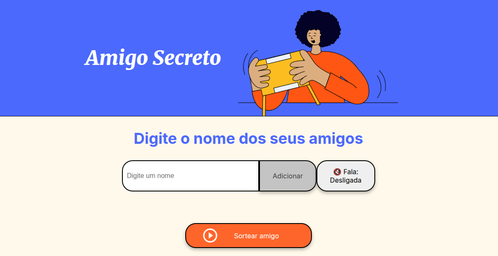

# 🎁 Amigo Secreto

Este é um projeto simples e interativo em JavaScript que permite aos usuários realizar um sorteio de **amigo secreto** de forma prática e divertida diretamente no navegador.

## 🧩 Descrição

Nesta aplicação, os usuários inserem nomes de amigos em uma lista e, ao final, podem realizar um sorteio aleatório para descobrir quem será o "amigo secreto" de quem.

O sistema garante que:
- Os nomes sejam exibidos de forma clara.
- Entradas inválidas sejam evitadas.
- O sorteio ocorra de maneira justa e aleatória.

## 🚀 Funcionalidades

- ✅ **Adicionar nomes:** Os usuários podem digitar o nome de um participante em um campo de texto e adicioná-lo à lista ao clicar em **"Adicionar"**.

- ✅ **Validação de entrada:** Se o campo estiver vazio, um alerta será exibido solicitando que o usuário insira um nome válido.

- ✅ **Visualização da lista:** Todos os nomes adicionados serão exibidos em uma lista visível logo abaixo do campo de entrada.

- ✅ **Sorteio aleatório:** Ao clicar em **"Sortear Amigo"**, um nome será escolhido aleatoriamente entre os adicionados e o resultado será exibido na tela.

- ✅ **Acessibilidade com voz:** A aplicação possui suporte para leitura de tela utilizando a API Web Speech, que pode ser ativada ou desativada por meio de um botão.

## 🛠️ Tecnologias utilizadas

- HTML5
- CSS3
- JavaScript (Vanilla)
- [Web Speech API](https://developer.mozilla.org/en-US/docs/Web/API/Web_Speech_API) (para leitura com voz, opcional)

## 📷 Demonstração

## 📦 Como usar

1. Clone este repositório ou baixe os arquivos.
2. Abra o arquivo [Jogo do amigo secreto](https://sorteioamigosecreto-14bxiwyhf.vercel.app/) em seu navegador.
3. Digite os nomes dos participantes e clique em **"Adicionar"**.
4. Após adicionar todos os nomes, clique em **"Sortear Amigo"**.
5. Ative a leitura em voz alta clicando no botão de fala.

## 💡 Possíveis melhorias futuras

- Permitir sortear todos os pares de amigo secreto sem repetições.
- Implementar envio por e-mail para cada participante com seu amigo secreto.
- Melhorar a interface visual com temas natalinos ou personalizados.

---

Feito com ❤️ para tornar o sorteio de amigo secreto mais divertido!
